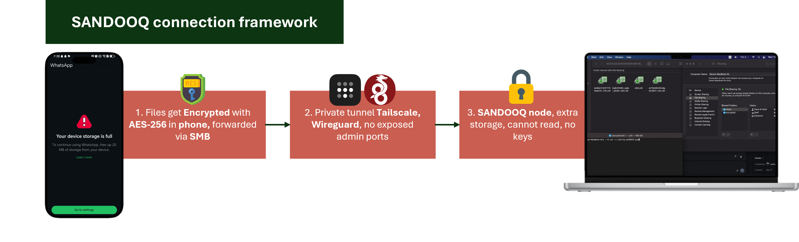
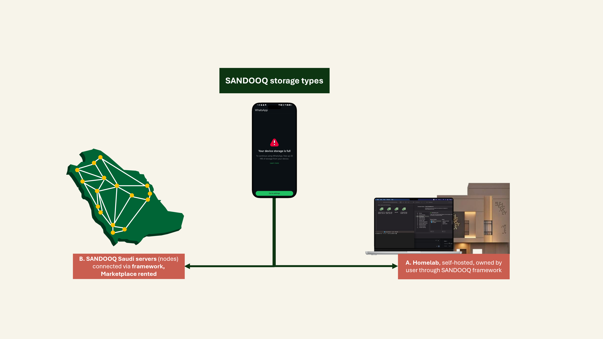

# SANDOOQ

**Sovereign, end-to-end encrypted cloud storage, owned by Saudis who use it.**

A Saudi-based alternative to paid iCloud storage, plus a marketplace that turns idle storage into income.

> **نبذة بالعربية:** صندوق منصة تخزين سحابي سعودية، مشفّرة من الطرف إلى الطرف. تمنح المستخدم مساحة خاصة على خوادم داخل المملكة، وتتيح لأي شخص يملك مساحة غير مستخدمة أن يؤجّرها ويحصل على دخل شهري. المشغّل لا يملك مفاتيح التشفير، لذلك لا يستطيع قراءة ملفات المستخدمين، ولا حتى أنا. الوصول الإداري يتم عبر شبكة **Tailscale** الخاصة والمشفّرة، فلا تُفتح منافذ غير ضرورية على الإنترنت.

**Final abstract:** [`ABSTRACT.md`](ABSTRACT.md) · **Full report (5 pages):** [`Sandooq-Report.pdf`](Sandooq-Report.pdf) · **Poster:** [`poster.pdf`](poster.pdf) · **Build guide:** [`SETUP.md`](SETUP.md) · **Glossary:** [`glossary.md`](glossary.md)

---

## The idea

Your photos are sitting in a foreign data centre right now. Your device runs out of space, and the only two buttons are *delete* or *pay*. SANDOOQ is the same convenience as built-in iCloud — except the server is yours, it lives in the Kingdom, and the operator cannot read a single file.

Two halves make it a product, not a project:

- **Storage for users.** Self-hosted, end-to-end encrypted space, hosted in Saudi Arabia, reachable from any device.
- **Income for hosts.** Anyone with spare capacity — an old laptop, an external drive, a NAS — runs a node and earns a monthly payout for the space they are not using.

## How a file travels

```
1. Your device        encrypted with your key, before it moves anywhere
        |
        v
2. Encrypted tunnel   HTTPS/TLS for users, SSH or the Tailscale tailnet for operators
        |
        v
3. SANDOOQ node       accounts and quotas, but no key, so no way to read anything
        |
        v
4. Storage            unreadable encrypted blocks on disk
        |
        v
5. Only your device   can decrypt it again
```

The storage folder shows only scrambled names such as `dirid.c9r` and `bm6btr7rD3T77XmbqcYX…i1A=.c9r`. No readable names, no images, no text, no clue what any file contains.



*Figure — SANDOOQ connection framework: encrypt on the device, forward over a private tunnel, store on a node that holds no keys.*



*Figure — SANDOOQ storage types: a self-hosted homelab the user owns, and rented Saudi marketplace nodes.*

## Security architecture: two nodes, one private network

| Node | What it is | Exposure |
|---|---|---|
| **Public node** | A rented server with a public IP | HTTPS on 443 for real users. SSH is **closed** to the internet. |
| **Private node** | A Mac at home | No public address. Reachable only inside the tailnet (`100.x.y.z`). |

Both nodes join a **Tailscale tailnet** (WireGuard, device-authenticated). This closes the server's SSH port to the whole internet, makes the home Mac reachable from anywhere without opening a router port, lets the two nodes federate, and admits testers to a private beta with no public exposure.

**Two layers, both required.** Cryptomator protects file *contents* from everyone including the operator. Tailscale protects the *network path* and removes unnecessary exposure.

**Honest limit.** Tailscale is private, not public: real users still reach the service over HTTPS on the public node; the tailnet is for operators, nodes and invited testers. A host can observe metadata, and anyone controlling a disk can delete data. What no one can do is **read** it.

## Who can read what

| Actor | Can read? | What they see |
|---|---|---|
| The user | **Yes** — holds the key | Everything they own |
| Node operator / host | No | Encrypted blocks, file counts, rough sizes |
| Network eavesdropper | No | Scrambled traffic |
| Internet port scanner | Nothing to reach | HTTPS only, no admin ports |
| Other users | No | Only what is explicitly shared |
| Thief with the disk | No | Unreadable storage |

## Why it beats iCloud

| Dimension | iCloud | SANDOOQ |
|---|---|---|
| Who can read your files | Apple holds the keys; you trust a policy | Only you; the key never leaves your device |
| Where files live | Data centres abroad | Inside Saudi Arabia |
| Verify privacy | No | Yes — the disk shows unreadable blocks |
| What you pay | A subscription, forever | Free tier, then plans below mainstream providers |
| Who earns | A foreign corporation | Saudi hosts, families and small businesses |

## Tech stack

Termius + macOS Terminal (Ed25519 keys) · **Tailscale** (WireGuard tailnet) · Apple Files, Samba (SMB), Secure ShellFish / Owlfiles (SFTP) · **Cryptomator** (AES-256 vaults) · Nextcloud or Seafile · Let's Encrypt · Docker or snap.

## Roadmap

| Phase | Goal |
|---|---|
| 0. Proof of concept (now) | Two nodes joined by a tailnet, HTTPS users, accounts, quotas, an encrypted vault, a host rental demo |
| 1. Private pilot (1–3 mo) | 10–30 testers in the tailnet, onboarding, backups, monitoring |
| 2. Multi-user product (3–6 mo) | Self-service signup, 2FA, mobile apps, billing, support |
| 3. Federation (6–12 mo) | Federated nodes, node directory, in-app node picker |
| 4. Market launch (12–18 mo) | Host app, reputation, payouts, commission |
| 5. Scale (18 mo+) | National network, B2B, white-label, partnerships, compliance |

## What this needs next

1. **One running instance, properly** — installed on the public node, reached over HTTPS with a real domain, with a working demo account.
2. **The two-node setup joined by Tailscale, working end to end.**
3. **A minimum host flow** — plug in a drive, register capacity, accept encrypted writes, see a usage report.
4. **A one-command installer** so anyone can reproduce the setup.
5. **Backups and a health check**, plus a rehearsed **30-second privacy proof**.

**What it does not need right now:** more slides, more ideas or a bigger network. It needs one working instance, two nodes joined securely, and one host earning their first riyal.

## Business model

- **Subscriptions:** free starter tier, paid plans in SAR below mainstream providers.
- **Marketplace commission:** a percentage of every rental between a user and a host.
- **Family and group plans:** one payer, many users.
- **Schools and small businesses:** private, PDPL-aligned storage.
- **Managed hosting and white-label:** setup and maintenance for organisations; licensing to local brands and ISPs.

## Repository contents

- `README.md` — this file
- `ABSTRACT.md` — the final one-page abstract
- `Sandooq-Report.pdf` — the 5-page project report for SAIF, with the connection-framework and storage-type figures
- `poster.pdf` — the SAIF scientific poster
- `SETUP.md` — the step-by-step build guide, including the Tailscale layer
- `glossary.md` — a bilingual technical glossary
- `media/` — the SANDOOQ logo, connection framework and storage-type visuals

## Status

Working proof of concept. Two nodes exist — a public server reached over HTTPS and a private Mac node — joined by Tailscale so the public node keeps its SSH port closed and the private node is usable from anywhere. Next: the host-earning demo, a second federated node, and the one-command installer.

## Author

**Dana Turki Alharbi** — Grade 9, Numou Education Center (Creativity Oasis), Alkhobar. Prepared for the SAIF scientific competition, Kingdom of Saudi Arabia.

*SANDOOQ. Storage you own. Privacy you can verify. Income that stays in the Kingdom.*
